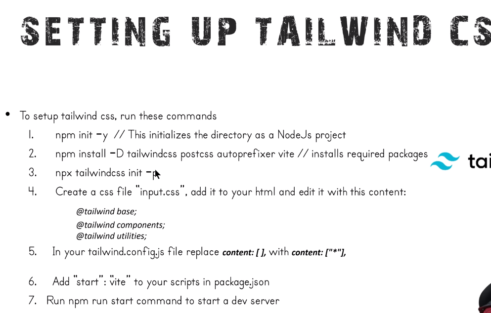

# Why use Tailwind CSS? + Prduction Setup

#### Tailwind CSS is a popular utility-first CSS framework that has gained significant traction in web development for several reasons. Here are some key reasons why developers choose to use Tailwind CSS:

## Rapid Development:
 Tailwind CSS allows developers to rapidly build user interfaces by providing a set of pre-designed, utility classes that can be easily applied to HTML elements. This speeds up the development process, as you can create complex layouts and styles without writing custom CSS from scratch.

## Consistency:
Tailwind CSS promotes a consistent design system by defining a consistent set of utility classes for styling. This helps ensure that your UI components maintain a consistent look and feel across your application.

## Responsive Design:
 Tailwind CSS makes it easy to create responsive designs. You can apply responsive classes to elements to control their appearance on different screen sizes, making your web applications more accessible on various devices.

## Customization:
 While Tailwind CSS provides a set of default utility classes, it's highly customizable. Developers can easily extend or modify the utility classes to fit their specific design needs. This flexibility allows you to maintain a unique design while benefiting from the framework's productivity gains.

## Readability:
 Tailwind CSS classes are descriptive and self-explanatory, which can improve code readability and make it easier for developers to understand and maintain the styling of a project.

## Low Specificity:
 Tailwind CSS follows a low specificity approach, which means it doesn't rely heavily on deeply nested selectors. This can make your CSS less prone to specificity-related issues and conflicts, leading to a more maintainable codebase.

## Community and Ecosystem:
 Tailwind CSS has a strong and active community. You can find a wealth of resources, plugins, and third-party tools to enhance your development workflow and extend the capabilities of the framework.

## Performance:
 Tailwind CSS is designed to be highly optimized for production. It generates small and efficient CSS files by default, which can contribute to faster load times for your web pages.

## Scalability:
 Tailwind CSS is suitable for both small and large-scale projects. Its modular and utility-first approach allows you to scale your application's styling without running into common CSS scalability issues.


## Will this make Site Slow? will it increase bundle Size?
### Ans --> No
### If No then How?
 It only sift those classes to production which you have used in app 


## Setting Up Tailwind CSS 


1. On Prduction we dont use CDN which we have use in last kecture in head 
2. For that we need to create one .css file in that we have to put this
    ``` 
    @tailwind base;
    @tailwind component;
    @tailwinf utilities;
    ```
3. What actually above code do ?
    - When you use tailwind classes in our code that classes are only get added in that file not all classes this is beauty
    - if you want to see just use 2,3 classes and inspect and check in that file you will get only those classes which you have used


# <p style="text-align: center;">Thank You! Will See more in Next Tutorial</p>